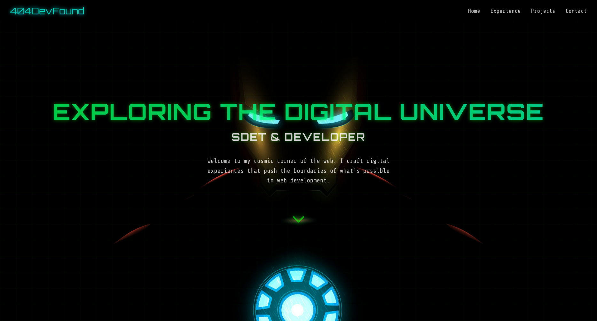

# 🦾 Space Portfolio - Full Stack Developer Portfolio

An Iron Man–inspired full-stack portfolio website featuring a glowing arc reactor theme, modern UI, and real-time project data fetched from a custom backend powered by MongoDB Atlas.



---

## 🌐 Live Links

- 🚀 Frontend (Vercel): [space-portfolio.vercel.app](https://space-portfolio.vercel.app)
- 🛠️ Backend (Render): [space-portfolio-api.onrender.com](https://space-portfolio-api.onrender.com)

---

## 📂 Project Structure

space-portfolio/
├── client/ # Vite + React frontend (Iron Man theme)
│ ├── src/
│ ├── public/
│ └── vite.config.ts
├── backend/ # Express + MongoDB backend
│ ├── models/ # Mongoose models
│ ├── routes/ # API endpoints
│ ├── controllers/ # Logic separated from routes
│ ├── server.js # Main server file
│ └── .env # Environment variables (Mongo URI, etc.)
├── README.md
└── package.json (root-level if monorepo)


---

## 🚀 Tech Stack

### 🔹 Frontend (client/)
- ⚛️ React with Vite
- 🎨 Tailwind CSS / Custom CSS
- 🔌 Axios (for API calls)
- 💌 EmailJS (contact form)
- 🧠 Framer Motion (animations)

### 🔸 Backend (backend/)
- 🧾 Express.js (Node.js server)
- 🛢️ MongoDB Atlas (cloud database)
- 📦 Mongoose (ODM)
- 🌍 Render.com (backend hosting)
- 🔒 dotenv for environment variables

---

## 🧠 Features

- 🖥️ Responsive portfolio sections (About, Projects, Skills, Contact)
- 🔄 Dynamic project data fetched from MongoDB
- 📧 Contact form with EmailJS integration
- 💻 GitHub/LeetCode stats (optional)
- 🔥 Iron Man arc-reactor themed UI with animations

---

## 📦 Setup Instructions

### 1. Clone the repo
```bash
git clone https://github.com/yourusername/space-portfolio.git
cd space-portfolio
```

### 2. Setup Backend
```bash
cd backend
npm install
```
## 📄 Create .env file
```bash
MONGO_URI=your-mongodb-atlas-connection-string
PORT=5000
```
## Run the backend
```bash
npm start
# or
npx nodemon server.js
```
Your API should now be running at: http://localhost:5000

### 3. Setup Frontend

```bash
cd ../client
npm install
```

## Set backend API URL in .env
```ini
VITE_API_URL=https://space-portfolio-api.onrender.com
```

## Run the frontend
```bash
npm run dev
```
Open in browser: http://localhost:5173

🌍 Deployment Instructions
🔹 Backend on Render

    Go to Render

    Create a new Web Service

    Link your backend/ folder repo

    Set environment variables:

        MONGO_URI

        PORT=5000

    Set start command: npm start

    Deploy

🔸 Frontend on Vercel

    Go to Vercel

    Import your GitHub repo and point to client/ directory

    Add environment variable:

        VITE_API_URL=https://space-portfolio-api.onrender.com

    Deploy
